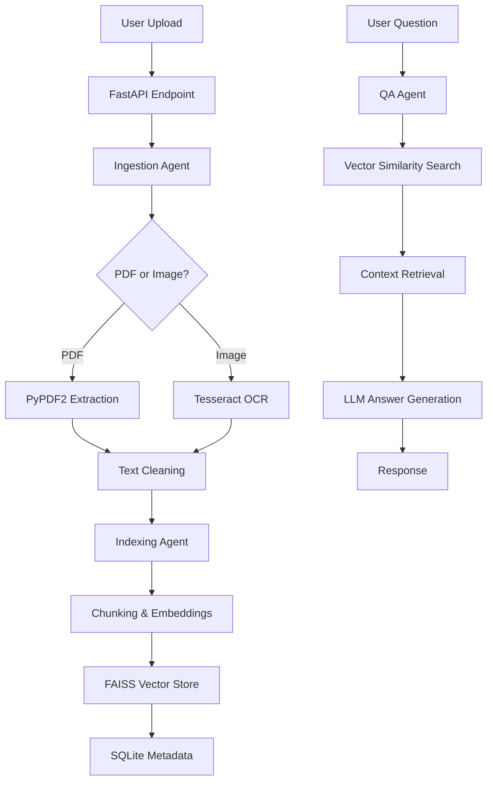

```markdown
#  Document AI Backend - Multi-Agent RAG System

> A production-ready, multi-agent document intelligence backend with RAG (Retrieval-Augmented Generation) for PDF and image processing.

#  Table of Contents
- [Overview](#overview)
- [Architecture](#architecture)
- [Tech Stack](#tech-stack)
- [Setup & Installation](#setup--installation)
- [API Documentation](#api-documentation)
- [Project Structure](#project-structure)
- [Development](#development)
- [Testing](#testing)
- [Deployment](#deployment)

---

## Overview

A **mini AI-powered document intelligence backend** that demonstrates multi-agent workflows, REST APIs, AI integrations, and file orchestration. Built with FastAPI, LangChain, and FAISS for vector search.

**Key Features:**
- **Multi-format support**: PDFs and Images (PNG, JPG, JPEG)
- **3-Agent workflow**: Ingestion → Indexing → QA
- **RAG pipeline**: Vector search with FAISS + LLM augmentation
- **FastAPI backend**: Type-safe REST APIs with auto-documentation
- **Local storage**: No cloud dependencies required
- **Groq LLM integration**: Fast inference with modern models

---

## Architecture

### System Flow


### Agent Responsibilities
| Agent | Responsibility | Key Technologies |
|-------|---------------|------------------|
| **Ingestion Agent** | File parsing, text extraction, OCR | PyPDF2, Tesseract, PIL |
| **Indexing Agent** | Chunking, embeddings, vector storage | LangChain, FAISS, Nomic |
| **QA Agent** | Context retrieval, answer generation | Groq LLM, LangChain RAG |

---


---

## Quick Start

### 1. Clone & Setup
```bash
# Clone repository
git clone <repo-url>
cd doc-ai-backend

python -m venv venv

venv\Scripts\activate


```

### 2. Install Dependencies
```bash
pip install -r requirements.txt
```

### 3. Configure Environment
```bash
# Copy example environment file
cp .env.example .env

# Edit .env with your API keys
# Required: GROQ_API_KEY from https://console.groq.com
# NOMIC_API_KEY
```

### 4. Install Tesseract OCR (Required for Images)
```bash
# Windows: Download from https://github.com/UB-Mannheim/tesseract/wiki
# Default install path: C:\Program Files\Tesseract-OCR\

# macOS
brew install tesseract

# Ubuntu/Debian
sudo apt-get install tesseract-ocr
```

### 5. Run the Server
```bash
python app.py
```
Server starts at: `http://localhost:8000`

### 6. Test the API
```bash
# Health check
curl http://localhost:8000/health

# API Documentation (Swagger UI)
# Open in browser: http://localhost:8000/docs
```

---

##  API Documentation

### Base URL
```
http://localhost:8000
```

### Endpoints

#### 1. **POST** `/api/upload`
Upload and process a document (PDF or image).

**Request:**
```bash
curl -X POST "http://localhost:8000/api/upload" \
  -F "file=@document.pdf"
```

**Response:**
```json
{
  "document_id": "07a1ef5d-d85f-43fa-8963-015be067b534",
  "filename": "document.pdf",
  "status": "processed",
  "chunks_created": 5,
  "vector_store": "vector_store/07a1ef5d..._index.faiss"
}
```

#### 2. **POST** `/api/ask`
Ask questions about processed documents.

**Request:**
```bash
curl -X POST "http://localhost:8000/api/ask" \
  -H "Content-Type: application/json" \
  -d '{"question": "What is the tech stack?", "document_id": "optional"}'
```

**Response:**
```json
{
  "question": "What is the tech stack?",
  "answer": "The tech stack includes FastAPI for backend, LangChain for AI workflows...",
  "document_id": "07a1ef5d-d85f...",
  "sources": [
    {
      "text": "Tech Stack: FastAPI, LangChain, FAISS...",
      "metadata": { "chunk_id": "...", "document_id": "..." },
      "score": 0.85
    }
  ]
}
```

#### 3. **GET** `/api/documents`
List all uploaded documents.

**Response:**
```json
[
  {
    "id": "07a1ef5d-d85f-43fa-8963-015be067b534",
    "filename": "Technical Task.pdf",
    "type": ".pdf",
    "processed": true,
    "created_at": "2025-12-27 23:07:52.780515"
  }
]
```

#### 4. **GET** `/health`
Health check endpoint.

**Response:**
```json
{
  "status": "healthy",
  "timestamp": "2025-12-27T23:15:30.123456"
}
```

---

##  Project Structure

```
doc-ai-backend/
├── app.py                          # FastAPI application entry point
├── requirements.txt                # Python dependencies
├── .env                           # Environment variables
├── .env.example                   # Example environment config
│
├── core/                          # Core application logic
│   ├── __init__.py
│   ├── config.py                  # App configuration & settings
│   ├── database.py                # SQLite operations & schema
│   └── models.py                  # Pydantic models for type safety
│
├── api/                           # API layer
│   ├── __init__.py
│   ├── routes.py                  # FastAPI route definitions
│   └── schemas.py                 # Request/response schemas
│
├── agents/                        # AI agents (separated concerns)
│   ├── __init__.py                # Agent exports
│   ├── ingestion_agent.py         # PDF/Image text extraction
│   ├── indexing_agent.py          # Chunking & embeddings
│   └── qa_agent.py               # Question answering with LLM
│
├── RAG/                           # RAG-specific functionality
│   ├── __init__.py
│   ├── workflow.py                # Document processing pipeline
│   └── vector_store.py            # FAISS operations & management
│
├── uploads/                       # Uploaded file storage
├── vector_store/                  # FAISS vector indices
└── database.db                    # SQLite database file
```

---

## 🔧 Configuration

### Environment Variables (.env)
```env
# Required: Get from https://console.groq.com
GROQ_API_KEY=your_groq_api_key_here


NOMIC_API_KEY=your_nomic_key_here


# Local paths
UPLOAD_DIR=uploads
VECTOR_STORE_DIR=vector_store
DB_PATH=database.db
```

### Configuration (core/config.py)
```python
# Allowed file types
ALLOWED_EXTENSIONS = ['.pdf', '.png', '.jpg', '.jpeg']

# Text processing
CHUNK_SIZE = 1000
CHUNK_OVERLAP = 200

# LLM settings
LLM_MODEL = "llama-3.3-70b-versatile"  # Groq model
LLM_TEMPERATURE = 0.1
MAX_TOKENS = 500
```

---

##  Development

### Running in Development Mode
```bash
# Auto-reload on code changes
python app.py
# Or with uvicorn directly
uvicorn app:app --host 0.0.0.0 --port 8000 --reload
```

### Code Style & Linting
```bash
# Install development dependencies
pip install black flake8 mypy

# Format code
black .

# Lint code
flake8 .

# Type checking
mypy .
```

### Adding New Features
1. **New Agent**: Create in `agents/` directory
2. **New API Endpoint**: Add to `api/routes.py`
3. **New Model**: Add to `core/models.py`
4. **Configuration**: Update `core/config.py`

---

## Testing

### Unit Tests
```bash
# Run all tests
python -m pytest tests/

# Run specific test file
python -m pytest tests/test_api.py -v

# Run with coverage
python -m pytest --cov=. tests/
```

### API Testing Scripts
```python
# test_api.py - Example test script
import requests

# Upload test
files = {'file': open('test.pdf', 'rb')}
upload_response = requests.post('http://localhost:8000/api/upload', files=files)
doc_id = upload_response.json()['document_id']

# Ask test
data = {'question': 'Test question', 'document_id': doc_id}
ask_response = requests.post('http://localhost:8000/api/ask', json=data)
print(ask_response.json())
```

### Manual Testing with cURL
```bash
# Test upload
curl -X POST "http://localhost:8000/api/upload" -F "file=@sample.pdf"

# Test question
curl -X POST "http://localhost:8000/api/ask" \
  -H "Content-Type: application/json" \
  -d '{"question": "What is this document about?"}'

# Test document listing
curl -X GET "http://localhost:8000/api/documents"
```

---

## Troubleshooting

### Common Issues & Solutions

| Issue | Solution |
|-------|----------|
| **Tesseract OCR not found** | Install Tesseract and set path in `agents/ingestion_agent.py` |
| **Groq API key invalid** | Get new key from https://console.groq.com |
| **FAISS dimension mismatch** | Delete `vector_store/` folder and reupload documents |
| **SQLite column errors** | Delete `database.db` and restart server |
| **Port 8000 in use** | Change port in `app.py` or use `--port` flag |

### Debug Mode
```python
# Enable verbose logging
import logging
logging.basicConfig(level=logging.DEBUG)
```

### Reset Application State
```bash
# Clear all data and start fresh
rm -rf uploads/ vector_store/ database.db
python app.py
```

---

## Performance

### Optimizations Implemented
- **FAISS for vector search**: Fast similarity matching
- **Chunk overlap**: Maintains context between chunks
- **Local embeddings fallback**: Works without API keys
- **SQLite indexing**: Fast document metadata retrieval

### Memory Usage
- **FAISS indices**: ~10MB per 1000 documents
- **SQLite database**: ~1MB per 100 documents
- **Upload storage**: Files stored as-is

---

##  Future Enhancements


1. **Batch processing** - Multiple file uploads
2. **WebSocket support** - Real-time progress updates
3. **Docker deployment** - Containerization
4. **Redis caching** - Faster response times
5. **User authentication** - API key management
6. **More file formats** - DOCX, TXT, CSV
7. **Hybrid search** - Keyword + vector search
8. **Advanced OCR** - Layout analysis, table extraction

### Scalability Considerations
- **Horizontal scaling**: Stateless agents
- **Database**: SQLite → PostgreSQL for production
- **Vector store**: FAISS → Pinecone for large datasets
- **File storage**: Local → S3/Cloud Storage

---

** Ready for production use with minimal configuration!**
```